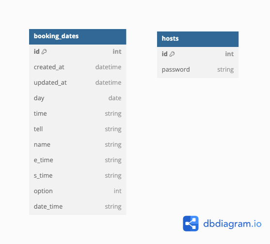

# さくら鍼灸室 予約アプリ

このサービスは、**さくら鍼灸室のホームページ兼予約システム**です。  
Webに不慣れなユーザーでも直感的に使えるよう、シンプルな設計を心がけています。

## 使用技術

- **言語／フレームワーク**
  - Ruby 2.7.6  
  - Ruby on Rails 7.0.5  
  - jQuery-Rails 4.5.1  

- **データベース**
  - 開発環境：SQLite3  
  - 本番環境：PostgreSQL 16

- **テスト**
  - RSpec 3.13

- **インフラ**
  - Render

## サービスURL

👉 [https://sakura-harikyuu.onrender.com](https://sakura-harikyuu.onrender.com)

---

## 概要

### 一般ユーザー側の機能

- 予約枠の空き状況を視覚的に確認
- 予約内容の最終確認
- 予約の新規作成（create）

### ホスト（管理者）側の機能

- 予約詳細の閲覧（名前、電話番号、メニュー、オプションなど）
- 予約データの削除（delete）
- 営業スケジュール（予約枠）の作成／削除

### その他

- 予約が完了すると、LINE Botを通じてホストに詳細を自動通知

※ UIのスクリーンショットは `/app/assets/images/` フォルダをご参照ください。

---

## ER図

---

## こだわりポイント

### 操作に不慣れなユーザーへの配慮

このサービスは、Webアプリに慣れていない方でもスムーズに利用できるように設計しています。そのため、ログインやアカウント登録といった複雑な機能はあえて導入していません。

#### なぜログイン機能を省いたのか？

1. **Webに不慣れなユーザーへの配慮**  
   サインイン／サインアップの概念は混乱を招く可能性があります。  
   特に、登録済みかどうか忘れてしまい、ログインできなくなるケースも多いため、ログイン機能は実装しませんでした。

2. **管理者が1人で運営しているため**  
   ユーザーによる予約の削除を許可すると、誤操作による情報の損失など現場の混乱を招くリスクがあるため、削除はホストのみが行える仕様としました。

---

## 反省点

- 初めてのアプリ開発だったため、コードやデータベース設計が未熟だった部分があります。
- 開発に時間がかかってしまいましたが、今後は設計段階からしっかりと構想を練り、よりスムーズな開発を目指します。
- 他の開発者のコードや設計（エッセンス）を学び、リファクタリングしていきたいと考えています。

---

## 追加実装

### LINE Bot APIの導入

ユーザーが予約を行った際、**公式LINEアカウント**からホストに以下の予約内容が自動送信されるようにしました。

- 予約日時（開始／終了）
- 氏名
- メニュー内容
- オプションの有無

ホストからの要望を受けて導入しました。

### RSpecの導入

Railsチュートリアルをきっかけに、**RSpecによるテストコード**を導入しました。  
実務でも広く使用されていることから、今後も継続的に学習・実装していきます。

---

## 参考文献

- [Qiita: Rails simple_calenderの使い方等](https://qiita.com/sssssatou/items/2e6606e3ddf9b246a0fb)

